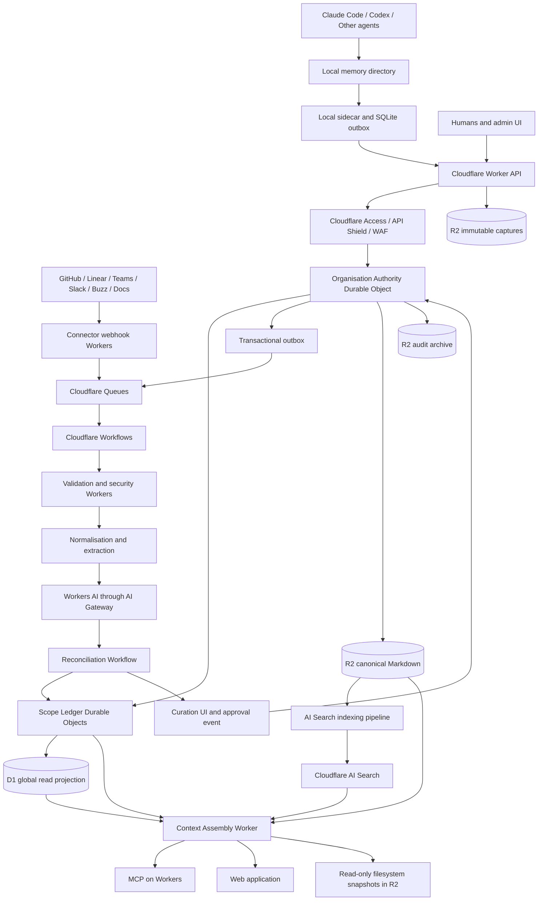

# Architecture for a Cloudflare-Native Multiplayer Organisational Memory System

**Status:** Proposed target architecture  
**Updated:** 2026-08-01  
**Deployment constraint:** All hosted application, storage, database, search, inference, workflow, identity-edge, security and observability components run on Cloudflare.

---

## Executive judgement

The central idea is sound: agents should be able to write durable Markdown memories locally, retain a private or scoped memory space, and benefit from knowledge produced by other agents and colleagues.

The important architectural correction is that **Cloudflare R2 must be the durable artefact and interchange layer, not the live collaborative filesystem, transactional database, search authority or reconciliation coordinator**.

The recommended platform has three logical planes, all hosted on Cloudflare:

| Plane | Responsibility | Cloudflare substrate |
|---|---|---|
| Capture and interchange | Local Markdown, imported source records, immutable versions, attachments, portable exports and snapshots | Local directories plus Cloudflare R2 |
| Control and knowledge | Identities, delegations, scopes, ACLs, provenance, versions, conflicts, approvals, retention, current pointers and reconciliation | SQLite-backed Durable Objects, with D1 read projections |
| Retrieval and delivery | Hybrid search, exact lookup, graph expansion, context assembly, MCP tools, web application and materialised filesystem views | Cloudflare AI Search, Durable Object FTS5, D1, Workers AI, Workers and R2 |

The decisive Cloudflare-native split is:

> **Durable Objects are the transactional and reconciliation authorities. D1 is the global catalogue and queryable read model. R2 is the immutable evidence and document store. AI Search is a disposable retrieval projection.**

This is not a simple “PostgreSQL to D1” migration. D1 is useful for organisation-wide directories, analytics, dashboards and queryable projections, but it should not be the sole serial coordinator for every write, conflict, ACL change and current-version transition. SQLite-backed Durable Objects provide strongly consistent, isolated and transactional state for a named organisation or scope. They are therefore the correct authority for collaborative memory state.

The other essential design decision is:

> **The “unified memory” is a permission-filtered, versioned materialised view—not a folder into which every user’s files are copied and merged.**

A single globally writable folder would flatten ownership, provenance, confidentiality, temporal validity, applicability and disagreement. Two memories can both be legitimate while applying to different repositories, branches, customers, environments, periods or teams.

“Global” should mean *available for authorised collective retrieval*, not *physically combined into one universally readable namespace*.

The recommended local interface is:

```text
~/.agent-memory/
├── inbox/          # writable: new captures from this user or agent
├── personal/       # read-only: accepted personal memories
├── projects/       # read-only: authorised project views
├── organisation/   # read-only: curated organisation-wide knowledge
├── sessions/       # writable: short-lived working memory
└── config.yaml
```

Claude Code, Codex and other agents may continue writing ordinary Markdown. A local sidecar watches `inbox/`, validates and synchronises files. The accepted collective corpus is delivered primarily through MCP search and context APIs, with optional read-only filesystem snapshots for compatibility.

The strict Cloudflare deployment has no hosted dependency on:

```text
PostgreSQL
pgvector
Redis
Kafka
Temporal
Supabase
Pinecone
WorkOS
Auth0
Vercel
AWS
GCP
Azure
Supermemory
Honcho
Graphiti
Mem0
Letta
```

External systems such as GitHub, Linear, Microsoft Teams, Slack, Notion, Google Drive, Salesforce or enterprise identity providers remain source systems or authentication authorities. They do not host any part of the memory platform itself.

---

## Architectural principles

The system is governed by the following principles.

### 1. Preserve evidence before interpretation

Raw captures and provider source objects are immutable. Extracted memories, summaries, claims and relationships are derived views linked back to evidence.

A coding lesson produced after resolving a bug does not replace the pull request, code, issue or incident record. It becomes a concise memory object that cites those sources.

Retrieval may combine:

```text
authoritative source facts
+ curated organisational interpretations
+ personal or agent lessons
+ live task context
```

### 2. Markdown is the portability boundary

Canonical memory documents use Markdown with YAML frontmatter, compatible with the general shape of the Open Knowledge Format.

Models, search engines, embedding models, connector implementations and agent harnesses can change without invalidating the corpus.

### 3. Scope is a first-class primitive

Knowledge naturally belongs to people, agents, repositories, teams, projects, customers, incidents, rooms and the organisation.

Scopes may overlap and form relationships. They cannot be represented safely by a user-directory hierarchy alone.

### 4. Permission filtering occurs before ranking

The platform never retrieves globally and asks a model to omit forbidden results.

The safe order is:

```text
authenticate
→ resolve actor and delegation
→ resolve current grants
→ constrain the candidate corpus
→ rank permitted records
→ hydrate permitted evidence
→ assemble context
```

### 5. Models propose; deterministic services decide

Models may extract claims, identify possible duplicates, suggest conflicts or propose scopes.

Deterministic code owns:

```text
authentication
authorisation
promotion rules
authority rules
retention
current-version pointers
validity windows
deletion
index publication
audit sequencing
```

### 6. Raw evidence is append-only

Corrections create new versions. Deletions produce tombstones and projection invalidations. History is not silently rewritten.

### 7. Search is a projection

AI Search, FTS indexes, graph tables and generated snapshots can be rebuilt from canonical state. None of them may override Durable Object and R2 state.

### 8. Every agent has its own identity

An agent invocation carries both:

```text
actor_principal = agent_codex_alice
delegating_principal = user_alice
```

The audit trail records that the agent acted under Alice’s delegation. The agent does not impersonate Alice.

---

## Research and design lessons

Several existing systems point toward the same architecture.

### Knowledge should surface where work happens

Useful organisational memory should not become another destination employees must remember to visit. Sources remain in GitHub, Linear, Teams, Slack, documents and business systems. Connectors extract and normalise their contents into a common model.

The same memory should surface in:

```text
coding agents
MCP clients
pull-request workflows
project tools
chat tools
web applications
internal operational applications
```

### Memory is one context layer

Persistent memories are not the whole context system. A robust agent should distinguish:

```text
institutional documents
source-system records
code-derived context
human annotations
accepted memories
personal preferences
live runtime context
```

An accepted memory should never erase its underlying source.

### People and collaborative spaces need isolated scopes

Each human, agent, team, project and repository should have its own scope, permissions and memory lifecycle. A shared core can exist without turning all knowledge into one flat namespace.

### Durable organisational memory differs from working memory

In-run coordination techniques, shared agent blocks and latent representations can improve token efficiency, but they are not suitable as the canonical organisational record.

Durable memory must remain:

```text
inspectable
portable
versioned
permissioned
auditable
source-linked
deletable
model-independent
```

### Contribution history matters

Stable principal identities and contribution histories enable expertise discovery, accountability and trust weighting. A memory-producing agent should have a durable identity distinct from the person who invoked it.

---

## Cloudflare service map

| Responsibility | Cloudflare service |
|---|---|
| API gateway and application code | Cloudflare Workers |
| Static web application | Workers Static Assets or Cloudflare Pages |
| Immutable document and object storage | R2 |
| Per-organisation transactional authority | SQLite-backed Durable Objects |
| Per-scope memory ledger | SQLite-backed Durable Objects |
| Organisation-wide relational read model | D1 |
| Primary hybrid retrieval | Cloudflare AI Search |
| Optional lower-level vector retrieval | Vectorize |
| Local exact and lexical retrieval | Durable Object SQL and FTS5 |
| Embeddings, extraction, classification and reranking | Workers AI |
| Inference observability and controls | AI Gateway |
| Asynchronous event transport | Cloudflare Queues |
| Durable multi-step orchestration | Cloudflare Workflows |
| Scheduled connector sync | Cron Triggers and Workflows |
| Human and MCP authentication edge | Cloudflare Access |
| Machine authentication | Access service tokens or mTLS |
| API protection | API Shield, WAF and rate limiting |
| Human abuse prevention | Turnstile |
| Upload malware detection | Cloudflare WAF upload scanning |
| Application secrets | Cloudflare Secrets Store |
| Short-lived non-authoritative caching | Cache API or KV |
| Long-term audit and backup archives | R2 |
| MCP endpoint | Workers or Agents SDK behind Access |
| MCP aggregation where useful | Cloudflare MCP portals |

Cloudflare Queues use at-least-once delivery. Every consumer must therefore be idempotent.

Cloudflare Workflows provide durable, retryable steps and can wait for external events or human approval. They are appropriate for ingestion, reconciliation, connector backfills, curation and deletion propagation.

---

## Target system architecture



The system follows an append-only capture path and a separately curated knowledge path.

---

## State ownership and consistency model

The platform has four state layers.

### 1. R2 immutable evidence and document layer

R2 stores:

```text
raw local captures
provider source payloads
canonical Markdown versions
attachments
generated scope snapshots
OKF-compatible exports
tombstones
audit archives
D1 exports and recovery artefacts
```

Objects are immutable by convention. Editing a memory creates another version. Existing canonical version objects are never overwritten.

Recommended layout:

```text
orgs/{org_id}/
├── captures/
│   ├── principals/{principal_id}/{yyyy}/{mm}/{capture_id}.md
│   └── integrations/{provider}/{source_id}/{revision_id}.json
├── canonical/
│   └── {scope_type}/{scope_id}/{memory_id}/{version_id}.md
├── indexable/
│   └── {access_partition}/{memory_id}/{version_id}.md
├── attachments/
│   └── {sha256_prefix}/{sha256}
├── snapshots/
│   └── {scope_type}/{scope_id}/{snapshot_id}.tar.zst
├── exports/
│   └── okf/{export_id}.tar.zst
├── database-backups/
│   └── d1/{yyyy}/{mm}/{backup_id}.sqlite
├── audit/
│   └── {yyyy}/{mm}/{dd}/{event_id}.json
└── tombstones/
    └── {memory_id}/{tombstone_id}.json
```

The `indexable/` namespace contains only accepted projection-safe documents. Raw, quarantined, rejected and restricted content is not indexed automatically.

R2 event notifications may publish object-change events to Queues. Application-originated writes also create explicit domain events so the processing system does not rely exclusively on storage notifications.

### 2. Organisation Authority Durable Object

Create one organisation authority object per organisation:

```text
OrganisationAuthority(org_id)
```

It owns:

```text
organisation revision clock
principal identities
agent and service identities
delegation relationships
membership versions
scope registry
scope relationships
access grants
source ACL snapshots
promotion requests
curation state
cross-scope conflict sets
current canonical pointers
retention-policy assignments
connector leases
idempotency records
transactional outbox
high-level audit sequence
```

This object is the serial authority for organisation-level governance.

Every accepted mutation receives an organisation revision:

```text
org_revision = 184422
```

The revision lets APIs, D1 projections, AI Search indexes and filesystem snapshots identify the exact organisational state they represent.

The organisation object should remain compact. Large content, claims and source payloads live in scope ledgers or R2.

### 3. Scope Ledger Durable Objects

Create a scope ledger for each material scope:

```text
ScopeLedger(org_id, scope_type, scope_id)
```

Examples:

```text
ScopeLedger(acme, principal, alice)
ScopeLedger(acme, agent, codex-alice)
ScopeLedger(acme, repository, payments-api)
ScopeLedger(acme, project, checkout-redesign)
ScopeLedger(acme, team, security)
ScopeLedger(acme, customer, northwind)
ScopeLedger(acme, organisation, acme)
```

Each scope ledger stores:

```text
memory items
memory versions
atomic claims
evidence relationships
memory relationships
validity intervals
local conflict candidates
curation actions
review schedules
scope-local audit events
exact identifiers
FTS5 lexical index
projection outbox
```

SQLite-backed Durable Objects provide transactional SQL, strong consistency, indexes, FTS5 and point-in-time recovery for each isolated scope.

A single object must not become an unbounded organisation-wide database. Scope partitioning distributes state and limits contention.

### 4. D1 global read model

D1 contains read-optimised projections rather than canonical transactional state.

Recommended tables:

```text
organisations
organisation_domains
principals
principal_aliases
memberships
scopes
scope_relations
source_connections
source_objects
memory_directory
memory_current_versions
memory_claim_directory
memory_relations
conflict_directory
pending_curations
access_partition_directory
sync_cursors
workflow_directory
connector_health
audit_directory
feedback
evaluation_cases
projection_versions
```

Every projected row includes:

```text
org_id
source_durable_object
source_revision
org_revision
projected_at
```

If D1 and a Durable Object disagree, the Durable Object wins.

D1 serves:

```text
admin dashboards
organisation-wide lists
connector management
job and workflow status
cross-scope directory lookup
analytics
audit discovery
non-authoritative graph traversal
search-result hydration
```

Read replication may be enabled for globally distributed read traffic. Requests requiring read-after-write consistency query the authority Durable Object directly or use D1 sessions and bookmarks.

---

## Cross-object transaction strategy

There is no general distributed SQL transaction across Durable Objects, D1, R2, Queues and AI Search.

The architecture therefore uses:

```text
single-object transactions
+ immutable artefacts
+ idempotent Workflows
+ transactional outboxes
+ organisation revision numbers
+ compensating actions
```

A cross-scope promotion runs as:

```text
reserve organisation revision
→ validate source version
→ write destination scope mutation
→ update source scope relationship
→ update organisation current pointer
→ write canonical R2 object
→ publish projection events
→ mark workflow complete
```

Every step is idempotent and keyed by the same mutation ID.

If a late step fails, the Workflow retries it. If policy requires reversal, a compensating mutation creates a new version or withdrawal event; it does not destructively erase the previous state.

---

## Transactional outbox

A Durable Object cannot atomically commit SQLite state and guarantee delivery of an external Queue message in the same transaction.

Each authority object therefore maintains an outbox table.

```text
BEGIN
    mutate canonical state
    insert outbox event
COMMIT
```

An alarm, RPC call or recovery Workflow sends pending outbox events to Queues. After confirmed publication, the object marks each event delivered.

Outbox entries contain:

```json
{
  "event_id": "evt_...",
  "organisation_id": "org_...",
  "aggregate_type": "memory",
  "aggregate_id": "mem_...",
  "aggregate_revision": 4,
  "organisation_revision": 184422,
  "event_type": "memory.accepted",
  "created_at": "2026-08-01T18:00:00Z"
}
```

Queue consumers store `event_id` as an idempotency key and reject stale aggregate revisions.

---

## Local sidecar

Install a lightweight daemon with adapters for Claude Code, Codex and arbitrary directories.

It watches only configured paths and maintains a local SQLite outbox so agents can write while offline.

A suggested local flow is:

```text
Agent writes .md
    ↓
sidecar waits for a stable file
    ↓
parse YAML and Markdown
    ↓
local secret and policy scan
    ↓
create capture envelope
    ↓
persist to SQLite outbox
    ↓
authenticated upload
    ↓
receive immutable capture ID and server status
    ↓
write local .sync metadata
```

### Sidecar responsibilities

```text
filesystem watching
stable-file detection
frontmatter validation
content hashing
local idempotency
local outbox and retry
credential acquisition and refresh
local secret scanning
optional local redaction warnings
snapshot download and unpacking
conflict-free local projection refresh
```

The sidecar does not receive direct R2 credentials.

It authenticates to a Worker as a particular human, agent or service principal. The Worker authorises the target scope and writes to R2 on its behalf.

This prevents a coding agent with shell access from enumerating or overwriting a tenant’s object namespace.

### Filesystem behaviour

| Directory | Behaviour |
|---|---|
| `inbox/` | Local, writable, single principal |
| `sessions/` | Local, writable, short retention |
| `personal/` | Server-generated, read-only |
| `projects/` | Server-generated, read-only |
| `organisation/` | Server-generated, read-only |
| Search | MCP or API, not directory traversal |

The sidecar writes projection directories by replacing versioned snapshot roots and switching a local pointer after the new snapshot is complete. It does not merge server files into a live writable directory.

---

## Why R2 mounting is not the primary interface

Object storage is not a collaborative POSIX filesystem.

A direct mount introduces failure modes such as:

```text
last-completed-writer wins
whole-object replacement for edits
weak or absent POSIX locking
cache divergence
non-standard rename behaviour
ambiguous directory semantics
concurrent mutation of one object key
```

The safe compromise for container compatibility is:

```text
mount only a principal-specific prefix
permit one writer
use immutable object names
use a local write-back cache
never permit multiple machines to mutate one object key
```

The preferred architecture remains a normal local directory plus synchronisation.

---

## Capture API and ingestion flow

The cloud flow is:

```text
1. Capture Worker authenticates the actor.
2. OrganisationAuthority resolves delegation and target scope.
3. Worker validates request size, type and idempotency key.
4. Worker writes an immutable R2 capture object.
5. OrganisationAuthority records the capture.
6. The same Durable Object transaction creates an outbox record.
7. The outbox publishes to a Queue.
8. A Queue consumer starts an Ingestion Workflow.
9. Workflow validates, normalises and extracts candidate claims.
10. Reconciliation queries relevant ScopeLedger objects.
11. Policy chooses automatic acceptance, quarantine or review.
12. Accepted content is written as a canonical R2 version.
13. ScopeLedger commits claims, versions and evidence links.
14. OrganisationAuthority updates current pointers.
15. Projection events update D1 and AI Search.
16. A new filesystem snapshot is generated where required.
```

### Capture API request

```json
{
  "capture_id": "cap_01J...",
  "organisation_id": "org_acme",
  "target_scope": {
    "type": "repository",
    "id": "repo_payments-api"
  },
  "actor": {
    "principal_id": "agent_codex_alice",
    "delegating_principal_id": "user_alice",
    "run_id": "run_01J..."
  },
  "content_hash": "sha256:...",
  "content_type": "text/markdown",
  "observed_at": "2026-08-01T18:00:00Z",
  "idempotency_key": "..."
}
```

The organisation ID and actor identity are derived or verified from the authenticated session. The server does not trust tenant identity supplied only in the body.

---

## Common source envelope

Every local capture and connector event is converted into a common source envelope before memory extraction.

```json
{
  "event_id": "evt_...",
  "organisation_id": "org_...",
  "principal_id": "agent_...",
  "delegating_principal_id": "user_...",
  "source": {
    "provider": "github",
    "object_type": "pull_request",
    "external_id": "repo:1234",
    "revision": "sha-or-updated-at",
    "canonical_locator": "provider-native-reference"
  },
  "scope_candidates": [
    {"type": "repository", "id": "repo_..."},
    {"type": "project", "id": "project_..."}
  ],
  "permissions": {
    "visibility": "source_inherited",
    "source_acl_revision": "..."
  },
  "observed_at": "2026-08-01T14:00:00Z",
  "content_hash": "sha256:...",
  "payload_object_key": "orgs/.../capture.json"
}
```

Connectors are idempotent on:

```text
(provider, external_id, revision)
```

Webhooks are delivery signals rather than complete truth. After receiving an event, the connector fetches the authoritative current object, stores its revision and advances a synchronisation cursor.

---

## Canonical memory document

An OKF-compatible canonical memory can look like:

```markdown
---
type: engineering.lesson
id: mem_01J...
schema_version: 1
title: Avoid reusing database transactions across concurrent workers
organisation: org_acme
scope:
  type: repository
  id: repo_payments-api
owners:
  - principal: user_alice
author:
  principal: agent_codex_alice
  delegating_principal: user_alice
  run_id: run_01J...
status: accepted
authority: derived
confidence: 0.91
sensitivity: internal
observed_at: 2026-07-30T18:44:00Z
valid_from: 2026-07-30T18:44:00Z
valid_to:
review_after: 2026-10-30T00:00:00Z
source_refs:
  - provider: github
    object: pull_request
    id: payments-api#1842
    revision: 7b912a...
supersedes: []
conflicts_with: []
tags: [database, concurrency, workers]
---

# Claim

Do not share a transaction-bound database client between concurrently
executing queue workers.

# Evidence

The failure was reproduced in PR 1842. Each worker succeeded after obtaining
its own transaction context.

# Applicability

Applies to the payments API worker runtime and other services using the same
database wrapper.

# Caveats

This does not prohibit sharing the connection pool itself.

# Verification

Run `tests/integration/test_concurrent_workers.py`.
```

`authority` and `confidence` are separate.

An agent can be highly confident in an inference whose authority remains `derived`. An approved policy can have high authority even when the platform cannot independently prove the policy is operationally correct.

---

## Principal and scope model

### Principal types

```text
human
agent
service
external_collaborator
```

A principal record includes:

```text
principal_id
organisation_id
principal_type
display_name
status
identity_aliases
owner_principal
created_at
disabled_at
```

### Delegation

An agent action includes:

```text
actor_principal
delegating_principal
delegation_grant
delegation_expiry
allowed_actions
allowed_scopes
credential_id
```

Delegation is explicit, time-bounded and revocable.

### Scope types

Initial scope types:

```text
organisation
team
project
repository
customer
room
principal
agent
session
incident
document_collection
```

Scopes may be related:

```text
repository --belongs_to--> project
project --owned_by--> team
agent --owned_by--> principal
incident --affects--> service
customer --served_by--> team
room --associated_with--> project
```

### Permission modes

Every source and memory uses one of:

```text
source_inherited
explicit_scope
organisation_public
private_to_principal
restricted_group
```

For `source_inherited`, retrieval checks the current provider-derived ACL or a recent synchronised permission snapshot.

An employee losing access to a repository, channel or document collection must also lose access to memories that would reveal that source.

---

## Identity and authentication

### Human authentication

Cloudflare Access protects:

```text
administrative web application
employee web application
curation interface
connector management
MCP endpoints
sensitive API routes
```

Access can use an enterprise identity provider or approved one-time-password flows.

The Worker validates the Access token and maps the identity to an internal principal.

Cloudflare Access authenticates the requester. The memory system’s Durable Objects authorise access to product resources.

### MCP and CLI authentication

Use Cloudflare Access managed OAuth for user-delegated MCP and CLI access.

A successful OAuth session maps to:

```text
human principal
organisation
Access application
granted OAuth scopes
allowed MCP tools
delegation policy
```

### Agent and machine authentication

| Client | Authentication |
|---|---|
| Managed organisation agent | Access service token or mTLS |
| User-installed sidecar | Short-lived user-authorised token |
| Internal Worker-to-Worker calls | Service bindings or authenticated RPC |
| External webhook | Provider signature plus WAF/API Shield controls |
| Build or CI service | Access service token with narrow policy |

Service tokens are individually identifiable, renewable and revocable.

### Directory lifecycle

The internal principal and membership ledger remains authoritative for the memory product.

External identity-provider users and groups may be synchronised through Cloudflare Access integrations. Lifecycle changes produce membership events:

```text
user created
user disabled
group membership added
group membership removed
identity alias changed
```

OrganisationAuthority applies those events and increments the organisation revision.

---

## Credentials and secrets

Cloudflare Secrets Store holds:

```text
OAuth application client secrets
webhook signing secrets
root credential-encryption keys
internal signing keys
connector application keys
mTLS materials where applicable
```

Per-organisation access and refresh tokens should not each become separately deployed Worker secrets.

Store provider credentials as encrypted records:

```text
ciphertext
nonce
encryption algorithm
root-key version
provider
organisation
credential owner
granted scopes
expiry
rotation metadata
```

The ciphertext may live in the OrganisationAuthority object or a restricted D1 table. The root wrapping key lives in Secrets Store.

Only the connector Worker decrypts a credential, using Workers Web Crypto. Refreshes and rotations run through Workflows.

---

## Validation and security processing

Before content becomes retrievable, run:

```text
request-schema validation
content-type validation
content-size validation
hash verification
malware detection for attachments
secret scanning
PII and regulated-data classification
sensitivity classification
prompt-injection labelling
scope-policy validation
attachment allow-listing
archive expansion limits
```

Source text is always untrusted data, not instructions to the ingestion or retrieval model.

Prompt-injection detection produces metadata such as:

```text
suspected_instructional_content
external_tool_request
credential_request
system-prompt imitation
data-exfiltration pattern
```

It does not grant the source any control over the pipeline.

### Cloudflare edge controls

Use:

```text
Cloudflare Access
WAF managed rules
API Shield
JWT validation
mTLS for selected endpoints
OpenAPI schema validation
per-principal rate limiting
Turnstile on public enrolment
malicious-upload detection
request-size limits
strict content-type rules
```

### Tenant isolation

Use multiple layers:

```text
tenant ID derived from authenticated identity
tenant-specific Durable Object IDs
tenant-prefixed R2 keys
tenant predicates in every D1 query
per-tenant or filtered AI Search
per-tenant encryption context
post-search ACL revalidation
separate audit sequences
```

For contractually isolated customers, support:

```text
dedicated R2 bucket
dedicated D1 database
dedicated AI Search instance
dedicated Worker deployment
dedicated routes
dedicated secrets
dedicated Durable Object namespace where required
```

The logical data model remains the same across shared and dedicated cells.

---

## Ingestion Workflow

Each capture starts a Workflow instance:

```text
ingest:{org_id}:{capture_id}:{capture_revision}
```

Suggested durable steps:

```text
load immutable capture
verify content hash
validate schema
run security classification
normalise source envelope
resolve scope candidates
extract entities
extract atomic claims
generate summary and applicability
retrieve reconciliation candidates
classify candidate relationships
apply authority and promotion policy
create proposed canonical mutation
wait for approval when required
commit scope-ledger mutation
write canonical R2 object
update organisation current pointer
enqueue D1 projection
enqueue AI Search indexing
schedule review
archive reconciliation report
```

Steps must be deterministic with respect to their inputs, or persist the exact model output used for later steps.

### Human approval

A Workflow may pause and wait for a curation event.

Approval payload:

```text
workflow_instance_id
proposal_id
proposal_revision
reviewer_principal
decision
approved_scope
reason
signed nonce
```

Before applying the decision, the Workflow verifies:

```text
proposal is still pending
reviewer still has permission
source version still exists
target scope still exists
no newer proposal supersedes it
```

---

## Atomic claim extraction

Reconciliation operates on atomic claims and version relationships, not whole-file merges.

For example:

```text
“The checkout service uses Redis locks, the timeout is 30 seconds,
and Alice owns the runbook.”
```

becomes:

```text
checkout-service --uses--> Redis lock
checkout-lock --timeout--> 30 seconds
checkout-runbook --owned_by--> Alice
```

Each claim stores:

```text
claim_id
subject
predicate
object or scalar value
scope
valid_from
valid_to
observed_at
authority
confidence
source evidence
applicability
status
```

One statement can be superseded without discarding the rest of the document.

---

## Reconciliation and curation

### Processing stages

| Stage | Operation | Durable output |
|---|---|---|
| Admission | Authenticate principal and target scope | Capture record |
| Validation | Parse schema and scan unsafe content | Validation result |
| Preservation | Write immutable content to R2 | Source object |
| Normalisation | Convert to common source envelope | Normalised source |
| Extraction | Produce claims, entities, links and applicability | Candidate claims |
| Candidate retrieval | Find exact, lexical, semantic and graph neighbours | Candidate set |
| Classification | Duplicate, extension, update, contradiction, mismatch or unrelated | Reconciliation proposal |
| Policy evaluation | Apply authority, confidence, sensitivity and approval rules | Proposed action |
| Curation | Automatic acceptance or human review | Curation event |
| Publication | Create canonical version and current pointer | Memory version |
| Indexing | Update search and read projections | Searchable projection |
| Projection | Regenerate authorised views | Snapshot manifest |
| Feedback | Record corrections and outcomes | Evaluation data |

### Memory state machine

```text
captured
    ↓
validated
    ↓
proposed
    ├── quarantined
    ├── rejected
    └── accepted
            ↓
        superseded
        expired
        withdrawn
        deleted
```

A correction creates a new version with:

```text
supersedes
reason
evidence
valid_from
reviewer
```

Deletion produces a tombstone and removes the memory from projections and indexes while retaining only the minimum audit information permitted by policy.

### Reconciliation classes

| Class | Meaning | Default action |
|---|---|---|
| Exact duplicate | Same meaningful content and provenance | Link capture to existing memory |
| Near duplicate | Same claim, different wording or evidence | Add evidence |
| Complementary | Adds a compatible caveat or example | Create related version or child |
| Temporal update | Previously correct fact changed | Close prior interval and create new version |
| Contradiction | Same scope and time, incompatible claims | Open conflict set |
| Scope mismatch | Both may be true in different contexts | Keep separate and refine applicability |
| Authority mismatch | Informal inference conflicts with authoritative source | Prefer authority but preserve conflict |
| Sensitive promotion | Narrow content proposed for broader audience | Require explicit review |

### Candidate comparison score

A candidate score only determines which memories should be compared.

```text
candidate_score =
    0.25 * semantic_overlap
  + 0.15 * entity_overlap
  + 0.15 * scope_overlap
  + 0.10 * temporal_overlap
  + 0.15 * source_relationship
  + 0.10 * lexical_overlap
  + 0.10 * shared_evidence
```

It does not decide which claim is true.

### Authority policy

A deterministic policy layer weighs:

```text
source authority
source explicitness
source ownership
source revision
temporal proximity
independent corroboration
scope match
human approval
agent reliability history
```

Default authority matrix:

| Knowledge type | Higher-authority source |
|---|---|
| Current code behaviour | Code at relevant commit, tests, merged PR |
| Intended architecture | Accepted ADR, approved design, code owners |
| Project status | Designated project system and owner |
| Incident cause | Final postmortem and verified corrective action |
| Personal preference | Explicit statement by the person |
| Customer commitment | Executed agreement or authorised CRM record |
| Operational procedure | Approved runbook plus recent execution |
| Informal expertise | Demonstrated contribution history and peer confirmation |

A merged pull request does not automatically override an ADR describing intended future architecture. An old runbook does not override current code after its review date.

### Promotion policy

Publishing becomes harder as audience grows.

```text
session → personal → project → team → organisation
 low review burden                 high review burden
```

Recommended defaults:

| Target scope | Default policy |
|---|---|
| Session | Automatic; short retention |
| Personal | Automatic for low-risk lessons |
| Agent | Automatic; visible to owner |
| Repository | Automatic only with strong source evidence |
| Project or team | Owner approval or corroborated evidence |
| Organisation | Human approval for normative claims |
| Restricted or security | Named approver and explicit source ACL |

Reviewers approve the claim and the audience separately. A statement can be correct but inappropriate for organisation-wide publication.

---

## Global memory view

For requester `P` and task `T`:

```text
effective_memories(P, T) =
    accepted personal memories(P)
  ∪ accepted memories of agents delegated by P
  ∪ accepted memories in scopes P may access
  ∪ relevant institutional source context
  − denied items
  − expired items
  − superseded items
  − task-inapplicable items
```

This effective view may be materialised into a read-only OKF-compatible bundle, but the bundle is disposable.

It is a projection of canonical state and permissions, not canonical state itself.

---

## Retrieval architecture

### Primary retrieval engine

Use Cloudflare AI Search as the first hybrid retrieval projection.

It provides:

```text
keyword search
vector search
hybrid retrieval
metadata filtering
relevance boosting
semantic reranking
query rewriting
R2-backed indexing
Workers bindings
```

AI Search never stores canonical truth. It indexes accepted projection documents.

### Search isolation

| Tenant or scope | Recommended topology |
|---|---|
| Enterprise or regulated tenant | Dedicated AI Search instance |
| Standard SaaS tenant | Shared cell instance with mandatory tenant filter |
| Private principal memory | Dedicated access partition or private instance |
| Restricted security scope | Dedicated instance or excluded from AI Search |
| Temporary session memory | ScopeLedger retrieval only |

### Indexed metadata

```json
{
  "org_id": "org_acme",
  "memory_id": "mem_...",
  "version_id": "ver_...",
  "scope_type": "repository",
  "scope_id": "repo_payments",
  "access_partition": "repo_payments_members",
  "status": "accepted",
  "sensitivity": "internal",
  "authority": "derived",
  "valid_from": 1785362400000,
  "valid_to": null,
  "review_after": 1793304000000,
  "source_revision": "7b912a",
  "org_revision": 184422
}
```

### Permission-safe retrieval order

```text
1. Authenticate requester.
2. Resolve actor and delegating principal.
3. Ask OrganisationAuthority for effective grants.
4. Convert grants into permitted access partitions.
5. Query only the correct tenant search instance.
6. Apply partition, status, validity and sensitivity filters.
7. Retrieve candidate IDs.
8. Recheck every candidate against current authority state.
9. Hydrate accepted versions and evidence.
10. Assemble a permission-safe evidence pack.
```

Post-search ACL rechecking is mandatory because indexing is asynchronous and permissions can change.

### Parallel retrieval paths

The Context Assembly Worker runs relevant paths in parallel:

```text
AI Search hybrid query
ScopeLedger exact identifier lookup
ScopeLedger FTS5 search for active scopes
D1 relationship-neighbour lookup
recent authority changes
provider refetch for freshness-critical data
```

It then performs:

```text
deduplication
scope-distance weighting
source-diversity limits
authority weighting
freshness checks
validity filtering
evidence expansion
token-budget packing
```

### Optional lower-level search

When more control is required, use:

```text
Vectorize semantic retrieval
+ ScopeLedger FTS5 lexical retrieval
+ Worker-based reciprocal-rank fusion
+ Workers AI reranking
```

Vectorize remains a projection and can be rebuilt from canonical R2 and Durable Object state.

### Freshness overlay

D1 and AI Search may lag canonical state.

Every response records:

```text
search_projection_revision
d1_projection_revision
current_organisation_revision
```

When a projection is behind, the Context Assembly Worker requests the changed-memory manifest from OrganisationAuthority and overlays:

```text
recently accepted memories
recently superseded memories
recently revoked grants
recent tombstones
```

This provides practical read-your-write behaviour without pretending the search index is transactional.

---

## Evidence pack and context assembly

`memory.search` returns evidence, not a final ungrounded answer.

A result includes:

```json
{
  "memory_id": "mem_...",
  "version_id": "ver_...",
  "title": "...",
  "claim": "...",
  "scope": {"type": "repository", "id": "repo_..."},
  "authority": "derived",
  "confidence": 0.91,
  "validity": {
    "valid_from": "...",
    "valid_to": null,
    "review_after": "..."
  },
  "applicability": "...",
  "evidence": [
    {
      "provider": "github",
      "object_type": "pull_request",
      "external_id": "payments-api#1842",
      "revision": "7b912a"
    }
  ],
  "conflicts": [],
  "retrieval": {
    "matched_by": ["hybrid", "identifier"],
    "projection_revision": 184400
  }
}
```

Context assembly should favour progressive disclosure:

```text
titles and claims
→ selected applicability and caveats
→ supporting source excerpts
→ full canonical memory
→ raw evidence only when needed
```

This keeps token usage bounded while preserving access to proof.

---

## MCP surface

The initial MCP server runs on Workers behind Cloudflare Access.

Recommended tools:

```text
memory.search
memory.get
memory.capture
memory.propose_correction
memory.list_conflicts
memory.get_scope_context
memory.find_expert
source.get_evidence
```

### `memory.search`

Inputs:

```text
query
requested scopes
task context
repository or project hints
time range
desired result count
```

Outputs permission-filtered evidence packs.

### `memory.get`

Fetches a canonical version, validity state, evidence, conflicts and relationships.

### `memory.capture`

Creates a new capture under the authenticated principal and delegated actor.

### `memory.propose_correction`

Creates a proposed new version. It never edits a canonical object in place.

### `memory.list_conflicts`

Returns unresolved conflict sets the requester may access.

### `memory.get_scope_context`

Returns a compact context bundle for a repository, project, team or customer.

### `memory.find_expert`

Uses reviewed contributions, ownership and source history to identify knowledgeable principals. It does not infer expertise from private content the requester cannot access.

### `source.get_evidence`

Fetches the authorised source object or provider reference supporting a memory.

The calling agent remains the orchestrator and decides whether to inspect sources, retrieve neighbours or broaden the scope.

---

## Workers AI and AI Gateway

All inference in the strict deployment runs through Workers AI.

Use Workers AI for:

```text
claim extraction
entity extraction
summarisation
scope classification
duplicate classification
contradiction proposals
embedding generation
reranking
context compression
sensitivity classification
answer generation where required
```

All model calls pass through AI Gateway for:

```text
observability
token and cost analytics
rate limiting
safe caching
retry policy
model fallback among Workers AI models
per-tenant budgets
request metadata
```

A literal Cloudflare-only deployment does not route AI Gateway to external model providers.

### Model-output recording

Persist for every consequential inference:

```text
model identifier
model version
prompt template version
input object hashes
structured output
confidence or score
validation result
timestamp
workflow step ID
```

This makes model-driven proposals reproducible enough for audit and evaluation.

---

## Source connectors

Each connector uses the same Cloudflare pattern:

```text
Webhook Worker
OAuth callback Worker
Queue
Connector Workflow
R2 source-object storage
OrganisationAuthority integration record
D1 connector projection
Secrets Store application secret
```

### Connector contract

Every connector implements:

```text
verify_webhook
resolve_tenant
fetch_authoritative_object
normalise_object
map_scopes
map_permissions
compute_revision
list_changes
backfill
handle_deletion
refresh_credentials
```

### GitHub

Use a GitHub App rather than broad personal access tokens.

Ingest:

```text
repositories
selected branches
commits
pull requests
reviews
review threads
issues and comments
releases
CODEOWNERS
ADRs and documentation
CI outcomes
```

GitHub records first become evidence.

Create memory candidates when:

```text
a PR is merged with durable rationale
a recurring failure is resolved
an ADR changes state
a review identifies a reusable lesson
a runbook changes
a post-merge correction establishes a constraint
```

A merged change plus passing tests is strong evidence about current code behaviour. An unmerged discussion is lower authority.

Flow:

```text
GitHub webhook
→ WAF and signature validation
→ Queue
→ Connector Workflow
→ authoritative GitHub fetch
→ immutable R2 source payload
→ normalised source envelope
→ memory extraction Workflow
```

### Linear

Map:

| Linear object | Memory treatment |
|---|---|
| Organisation | Tenant integration |
| Team | Team scope |
| Project | Project scope |
| Issue | Task evidence |
| Project document | Institutional source |
| Issue comment | Discussion evidence |
| Label | Tag candidate |
| State change | Temporal event |
| Assignee or lead | Ownership signal |

Linear is authoritative for workflow status only when the organisation treats it as such. It is not generally authoritative for exact code behaviour.

### Microsoft Teams and Slack

Preserve:

```text
tenant or workspace
team and channel
thread identity
message author
reply structure
edits and deletions
attachments
mentions
source permissions
retention restrictions
```

Do not index isolated acknowledgements or context-dependent replies as standalone memories.

Distil a thread into:

```text
question
decision
outcome
systems involved
participants
unresolved points
source references
```

Store both the distilled representation and authorised raw evidence.

### Notion, Drive and document systems

Documents become institutional sources with:

```text
document ID
revision
owners
permissions
path or collection
modified time
source links
```

A document is not automatically an accepted memory. Extraction creates candidate claims linked to its revision.

### CRM and customer systems

Add domain-specific memory types:

```text
customer_commitment
account_insight
sales_objection
meeting_outcome
risk
process_exception
```

Authority rules must distinguish:

```text
executed agreement
authorised CRM record
sales note
meeting transcript
agent inference
```

### Buzz and agent event systems

Treat Buzz initially as another interaction and contribution source.

Map:

```text
projects
messages
artefacts
repository events
agent identities
contribution chains
signatures
```

Buzz-inspired signed contribution histories can later strengthen principal identity and expertise modelling without making Buzz a platform dependency.

### Scheduled backfills

```text
Cron Trigger
→ start connector Workflow
→ acquire connector lease
→ read sync cursor
→ request provider pages
→ write source revisions to R2
→ enqueue normalised events
→ advance cursor
→ release lease
```

Leases live in OrganisationAuthority to prevent duplicate concurrent backfills.

---

## Permission pass-through

Every source object records:

```text
permission_mode
source_acl_revision
allowed principals or groups
denied principals or groups
last_verified_at
```

For source-inherited memories:

```text
source ACL change
→ connector event
→ OrganisationAuthority grant revision
→ projection invalidation
→ AI Search reindex or deletion
→ filesystem snapshot regeneration
```

A revocation takes effect at authority evaluation immediately, even if the search index has not yet been updated.

This is why every search result is rechecked after retrieval.

---

## Temporal validity and review

Organisational knowledge changes over time.

Every claim supports:

```text
observed_at
valid_from
valid_to
review_after
superseded_by
source_episode
```

Default review policies vary by type:

| Memory type | Example review policy |
|---|---|
| Stable protocol lesson | Annual |
| On-call procedure | Quarterly |
| Project status | Days or weeks |
| Customer commitment | Until fulfilled or amended |
| Security process | Short interval plus named reviewer |
| Personal preference | User-controlled |
| Repository behaviour | Re-evaluate on relevant source revision |

A scheduled Workflow creates review tasks when `review_after` is reached.

Expired content is not deleted automatically. It remains historical evidence but is excluded from current-context retrieval unless a historical query requests it.

---

## Read-only filesystem projections

Some coding agents work better with files than MCP.

The platform therefore generates disposable read-only snapshots:

```text
snapshot manifest
canonical Markdown files
scope index
relationship links
projection revision
generated timestamp
```

Snapshot path:

```text
orgs/{org_id}/snapshots/{scope_type}/{scope_id}/{snapshot_id}.tar.zst
```

A snapshot manifest includes:

```json
{
  "snapshot_id": "snap_...",
  "organisation_revision": 184422,
  "principal_id": "user_alice",
  "scope_ids": ["repo_payments", "project_checkout"],
  "generated_at": "...",
  "files": [
    {
      "path": "projects/checkout/mem_....md",
      "sha256": "...",
      "memory_id": "mem_...",
      "version_id": "ver_..."
    }
  ]
}
```

Snapshots are principal-specific when effective permissions differ.

The sidecar downloads, verifies and atomically switches to the new projection.

---

## Deletion and retention

Deletion is a multi-step Workflow:

```text
validate deletion authority
→ create tombstone
→ update current pointer
→ mark claim status
→ remove from AI Search
→ invalidate D1 projections
→ regenerate snapshots
→ apply source and legal-retention rules
→ archive minimum audit record
```

Possible states:

```text
withdrawn
soft_deleted
hard_deleted
retained_for_legal_hold
```

A right-to-delete request must distinguish:

```text
source content
derived memory
audit record
shared organisational fact
content owned by other principals
```

The platform should remove personal data without destroying independent organisational evidence that the requester does not exclusively own, subject to policy and law.

Retention policies are attached to:

```text
organisation
scope
memory type
sensitivity
source provider
legal hold
```

---

## Caching rules

KV and Cache API never hold authoritative versions, ACLs or reconciliation state.

They may cache:

```text
public schemas
connector metadata
short-lived scope manifests
short-lived permission decisions
rendered snapshot manifests
model-independent retrieval fragments
```

Every cached permission decision includes:

```text
principal_id
org_revision
grant_revision
expiry
```

A newer grant revision invalidates the cached decision.

---

## Audit model

Every authoritative action produces an event containing:

```text
event_id
organisation_revision
actor_principal
delegating_principal
action
target
previous_version
new_version
policy decision
source references
request ID
workflow ID
timestamp
```

Recent audit indexes live in D1.

Long-term immutable audit records are written to R2.

Examples:

```text
capture.created
memory.proposed
memory.accepted
memory.superseded
memory.withdrawn
grant.added
grant.revoked
scope.created
connector.authorised
connector.credential_rotated
source.deleted
snapshot.generated
search.projection_updated
```

---

## Observability

Track:

```text
Worker request logs
Durable Object latency and storage
outbox backlog
Queue depth and retries
dead-letter queue volume
Workflow status and step failures
D1 projection lag
AI Search indexing lag
Workers AI latency and error rate
AI Gateway token usage
connector freshness lag
snapshot generation lag
permission-recheck failures
```

Critical alerts:

```text
dead-letter queue receives a message
permission false-positive detected
audit sequence gap
canonical R2 hash mismatch
outbox oldest age exceeds threshold
search projection falls materially behind
connector credential refresh fails
scope ledger approaches storage or contention threshold
```

---

## Backup and recovery

Use:

```text
Durable Object point-in-time recovery
D1 Time Travel
scheduled D1 exports to R2
immutable canonical Markdown in R2
rebuildable D1 projections
rebuildable AI Search indexes
replayable audit and projection events
```

A restoration sequence is:

```text
restore OrganisationAuthority and ScopeLedger state
→ verify canonical R2 hashes
→ rebuild D1 projections
→ recreate AI Search indexes
→ reindex accepted versions
→ regenerate filesystem snapshots
→ run permission and retrieval evaluations
```

### Disaster-recovery test

Run a periodic recovery exercise:

```text
restore into an isolated Cloudflare environment
rebuild projections from canonical state
compare organisation revisions
compare memory counts and hashes
run golden permission tests
run golden retrieval tests
verify tombstones
verify connector cursors
```

---

## Data ownership map

| Entity | Cloudflare authority |
|---|---|
| Organisations | OrganisationAuthority; D1 projection |
| Principals | OrganisationAuthority; D1 projection |
| Memberships | OrganisationAuthority; D1 projection |
| Delegations | OrganisationAuthority |
| Scopes | OrganisationAuthority |
| Scope relations | OrganisationAuthority; D1 projection |
| Source connections | OrganisationAuthority |
| Provider credentials | Encrypted record plus Secrets Store root key |
| Source objects | R2 plus D1 directory |
| Captures | R2 plus ScopeLedger record |
| Memory items | ScopeLedger |
| Memory versions | ScopeLedger plus R2 Markdown |
| Claims | ScopeLedger |
| Evidence links | ScopeLedger plus R2 references |
| Memory relations | ScopeLedger plus D1 graph projection |
| Conflict sets | ScopeLedger or OrganisationAuthority |
| Curation actions | ScopeLedger plus R2 audit |
| Access grants | OrganisationAuthority |
| Retention policies | OrganisationAuthority |
| Embeddings and search chunks | AI Search or Vectorize projection |
| Sync cursors | OrganisationAuthority |
| Jobs | Workflows plus D1 directory |
| Audit events | Durable Objects, D1 directory and R2 archive |
| Feedback | D1 plus optional R2 archive |
| Evaluation cases | D1 and R2 fixtures |
| Filesystem snapshots | R2 |

---

## Memory engine strategy

No external memory engine owns the canonical ledger.

The strict Cloudflare architecture is:

```text
Canonical artefacts:
    R2

Transactional memory ledger:
    SQLite-backed Durable Objects

Global relational read model:
    D1

Initial hybrid retrieval:
    Cloudflare AI Search

Custom semantic retrieval:
    Vectorize

Local lexical retrieval:
    Durable Object FTS5

Claim extraction and reranking:
    Workers AI

Inference controls:
    AI Gateway

Temporal and relationship graph:
    ScopeLedger edge tables
    + D1 graph projection
    + bounded Worker traversal
```

### Temporal graph model

A Graphiti-style temporal model can be implemented directly:

```text
entity
relationship
valid_from
valid_to
observed_at
source_episode
authority
confidence
superseded_by
```

ScopeLedger stores authoritative local graph edges. D1 stores a cross-scope projection for discovery.

Bounded graph traversal runs in a Worker and revalidates permissions for every returned node and edge.

### Optional compatibility adapters

Adapters may export to or import from:

```text
Supermemory
Honcho
Mem0
Zep or Graphiti
Letta
```

These integrations are optional and must not own:

```text
public memory IDs
canonical versions
permissions
source evidence
current pointers
audit history
```

---

## Expertise index

The platform can derive an expertise graph from reviewed contributions.

Signals:

```text
merged contributions
approved memories
source ownership
incident participation
review history
documentation ownership
peer confirmation
recent activity
```

Expertise is scope-specific and time-dependent.

Example:

```text
principal_alice
    expertise: payments-api
    evidence: 18 merged PRs
    evidence: 4 approved runbook updates
    evidence: incident-2026-17 owner
    last_active: 2026-07-28
```

Private memories cannot be used to expose expertise to unauthorised requesters.

`memory.find_expert` returns evidence-backed explanations, not unexplained scores.

---

## Evaluation

Build a golden evaluation set before optimising models.

Each case contains:

```text
requester and memberships
delegating principal
task and repository
expected memories
forbidden memories
expected sources
known contradiction
desired abstention behaviour
expected historical validity
```

Measure:

```text
retrieval recall
retrieval precision
citation support
stale-memory rate
contradiction detection
permission-filter accuracy
context-token cost
memory acceptance rate
correction recurrence
source freshness lag
projection lag
```

The permission false-positive target is zero.

A retrieval miss is frustrating. A permission leak is product-ending.

### Model evaluation

For extraction and reconciliation:

```text
claim completeness
claim atomicity
scope accuracy
duplicate classification
contradiction recall
false conflict rate
authority-policy agreement
human acceptance rate
```

Store evaluation fixtures in R2 and test metadata in D1.

---

## Operational metrics

| Metric | Purpose |
|---|---|
| Supported-answer rate | Whether retrieved context supports agent output |
| Citation correctness | Whether evidence entails the claim |
| Permission false-positive rate | Whether forbidden memory is returned |
| Stale-memory exposure | Whether expired or superseded facts reach users |
| Conflict-resolution time | Duration of unresolved high-impact conflicts |
| Memory acceptance rate | Quality of agent-proposed memories |
| Correction recurrence | Whether corrected errors reappear |
| Retrieval latency | Responsiveness inside agents |
| Context tokens per successful task | Context efficiency |
| Source freshness lag | Delay from provider change to searchable update |
| D1 projection lag | Read-model freshness |
| AI Search projection lag | Retrieval-index freshness |
| Outbox age | Reliability of event publication |
| Workflow failure rate | Orchestration health |
| Snapshot lag | Filesystem compatibility freshness |

---

## Capacity and partitioning

### Organisation Authority

One organisation authority object is suitable while:

```text
organisation-level write contention is moderate
membership and grant state remains compact
cross-scope coordination is not excessively hot
```

For very large tenants, split auxiliary responsibilities into deterministic child objects:

```text
OrgIdentityShard
OrgGrantShard
OrgConnectorShard
OrgConflictShard
```

The root OrganisationAuthority retains the organisation revision clock and routing metadata.

### Scope ledgers

Large scopes can split by stable partitions:

```text
repository + memory ID prefix
customer + account segment
organisation + memory type
time-windowed session scope
```

The public scope remains one logical scope. OrganisationAuthority maps it to physical ledger shards.

### D1 cells

A multi-tenant service should use deployment cells.

Each cell contains:

```text
Workers
D1 database
R2 bucket or prefixes
AI Search instances
Durable Object namespaces
Queues
Workflows
Secrets
```

An organisation directory routes a tenant to its cell. Dedicated enterprise tenants may receive their own cell.

---

## Failure handling

### Duplicate Queue delivery

Use `event_id` idempotency keys and aggregate revisions.

### Workflow retries

Every external side effect uses a stable operation ID:

```text
R2 object key
D1 upsert key
AI Search document ID
ScopeLedger mutation ID
```

### D1 projection failure

Canonical state remains valid. The projection event stays pending or is replayed. Dashboards may be stale but writes remain safe.

### AI Search indexing failure

The memory remains canonical and retrievable through exact or FTS paths. The indexing event is retried.

### Connector outage

The connector health projection shows stale status. Existing memories retain their last known source revision and freshness warning.

### Provider permission uncertainty

Exclude source-inherited content from retrieval until the ACL can be verified, unless policy explicitly allows a bounded grace period.

### Durable Object unavailable or corrupt

Use point-in-time recovery, immutable R2 artefacts and audit events to restore and verify state.

### R2 write succeeds but authority commit fails

The object remains an unreferenced immutable artefact. A sweeper Workflow finds unreferenced captures and either completes admission or expires them according to policy.

### Authority commit succeeds but R2 canonical write fails

The Workflow does not update the public current pointer until the canonical object exists and its hash is verified.

---

## Delivery sequence

### Phase 1: Cloudflare foundation

Build:

```text
Worker capture API
Cloudflare Access authentication
OrganisationAuthority Durable Object
ScopeLedger Durable Object
R2 immutable capture layout
Queue with dead-letter queue
Ingestion Workflow
D1 global read projection
basic MCP Worker
```

Support:

```text
Claude Code directories
Codex directories
manual Markdown
private scope
repository scope
project scope
organisation scope
```

The first release proves capture, provenance, scope and authority.

### Phase 2: Retrieval and curation

Add:

```text
Workers AI extraction
AI Gateway
AI Search indexing
hybrid retrieval
permission-filtered Context Assembly Worker
canonical publication
conflict sets
curation Workflows
review web application
filesystem snapshot generation
```

The curation UI shows:

```text
proposed claim
source evidence
related memories
detected contradiction
scope and audience
authority and confidence
suggested action
diff against previous version
```

### Phase 3: Structured connectors

Add:

```text
GitHub
Linear
```

These provide stronger structured provenance than broad chat ingestion and make reconciliation easier to evaluate.

### Phase 4: Enterprise identity and security

Add:

```text
enterprise IdP integration through Access
group lifecycle synchronisation
service tokens
mTLS for selected clients
API Shield
WAF upload controls
retention policies
audit exports
recovery drills
dedicated tenant cells
```

### Phase 5: Collaboration and business sources

Add:

```text
Teams or Slack
Notion
Google Drive
CRM
customer support
email where appropriate
Buzz
```

Chat sources require thread-aware distillation and stricter quality controls.

### Phase 6: Advanced organisational intelligence

Add:

```text
expertise index
temporal graph traversal
source-authority learning
scope recommendations
automatic review scheduling
memory quality scoring
cross-agent working-memory projections
advanced retrieval evaluation
```

---

## Principal risks and mitigations

| Risk | Mitigation |
|---|---|
| R2 mount corruption or last-writer loss | Local writable directory, immutable uploads, server versions |
| Hot organisation Durable Object | Keep content in scope ledgers; shard auxiliary state |
| Cross-object partial failure | Workflows, idempotency, outboxes and compensating mutations |
| Memory pollution | Promotion state machine and evidence thresholds |
| Conflicting facts | Atomic claims, validity intervals and conflict sets |
| Secret leakage | Local and server scanning before indexing |
| Cross-tenant leakage | Brokered access, tenant routing and ACL recheck |
| Stale knowledge | Review dates, source revisions and validity windows |
| Hallucinated provenance | Immutable evidence and revision verification |
| Search-index drift | Projection revisions and rebuilds |
| D1 inconsistency with authority | Durable Objects win; projection repair |
| Vendor model changes | Canonical Markdown and model-independent state |
| Excessive context | Scope-aware retrieval and progressive disclosure |
| Agent impersonation | Separate actor and delegating principal |
| Deletion inconsistency | Tombstones, projection invalidation and workflows |
| Low adoption | Integrate with existing agents and work surfaces |
| Provider outage | Freshness indicators and last-known evidence |
| Queue duplication | Event IDs and idempotent consumers |
| Workflow poison event | Dead-letter path and manual replay tooling |

---

## Final recommended architecture

Build an **event-sourced, scope-aware organisational memory ledger entirely on Cloudflare**.

```text
Cloudflare Workers
    APIs, connectors, context assembly, MCP and web application

SQLite-backed Durable Objects
    transactional organisation and scope authority
    identities, delegations, permissions, versions, claims,
    conflicts, current pointers and reconciliation state

Cloudflare D1
    global directories, dashboards, analytics and queryable projections

Cloudflare R2
    immutable evidence, canonical Markdown, attachments,
    exports, snapshots, backups and audit archives

Cloudflare Queues
    idempotent asynchronous domain events

Cloudflare Workflows
    durable ingestion, reconciliation, approval, connector,
    deletion and projection processes

Workers AI
    extraction, embeddings, classification, summarisation and reranking

AI Gateway
    inference observability, limits and Workers AI routing

Cloudflare AI Search
    permission-constrained hybrid retrieval over accepted projections

Cloudflare Access, API Shield and WAF
    authentication edge and protection for humans, agents,
    connectors, APIs and MCP

Cloudflare Secrets Store
    application secrets and root credential-encryption keys
```

The core rule is:

> **R2 preserves what was written. ScopeLedger Durable Objects decide what it means. OrganisationAuthority decides who may use it. D1 makes it discoverable. AI Search makes it retrievable. None of the projections can override canonical Durable Object and R2 state.**

This retains the simplicity and portability of Markdown, preserves source evidence, avoids treating object storage as a collaborative filesystem, and creates a credible path from coding-agent lessons to a universal memory base spanning engineering, project management, sales, operations and other organisational work.

---

## Official Cloudflare implementation references

- Durable Objects overview: https://developers.cloudflare.com/durable-objects/
- SQLite-backed Durable Object storage: https://developers.cloudflare.com/durable-objects/api/sqlite-storage-api/
- Durable Object storage access patterns: https://developers.cloudflare.com/durable-objects/best-practices/access-durable-objects-storage/
- D1 documentation: https://developers.cloudflare.com/d1/
- R2 documentation: https://developers.cloudflare.com/r2/
- R2 event notifications: https://developers.cloudflare.com/r2/buckets/event-notifications/
- Cloudflare Queues delivery guarantees: https://developers.cloudflare.com/queues/reference/delivery-guarantees/
- Cloudflare Workflows: https://developers.cloudflare.com/workflows/
- Workflow events and waiting: https://developers.cloudflare.com/workflows/build/events-and-parameters/
- Cloudflare AI Search: https://developers.cloudflare.com/ai-search/
- AI Search hybrid search: https://developers.cloudflare.com/ai-search/configuration/indexing/hybrid-search/
- AI Search metadata filtering: https://developers.cloudflare.com/ai-search/configuration/retrieval/filtering/
- AI Search multitenancy: https://developers.cloudflare.com/ai-search/how-to/per-tenant-search/
- Vectorize: https://developers.cloudflare.com/vectorize/
- Workers AI: https://developers.cloudflare.com/workers-ai/
- AI Gateway: https://developers.cloudflare.com/ai-gateway/
- Cloudflare Access: https://developers.cloudflare.com/cloudflare-one/access-controls/
- Access service tokens: https://developers.cloudflare.com/cloudflare-one/access-controls/service-credentials/service-tokens/
- API Shield: https://developers.cloudflare.com/api-shield/
- Secrets Store: https://developers.cloudflare.com/secrets-store/
